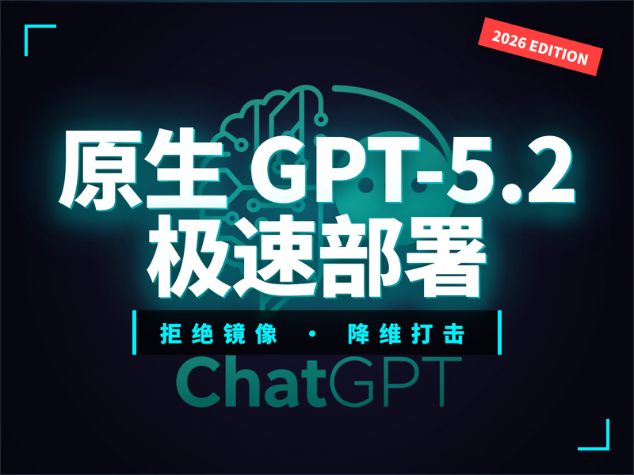
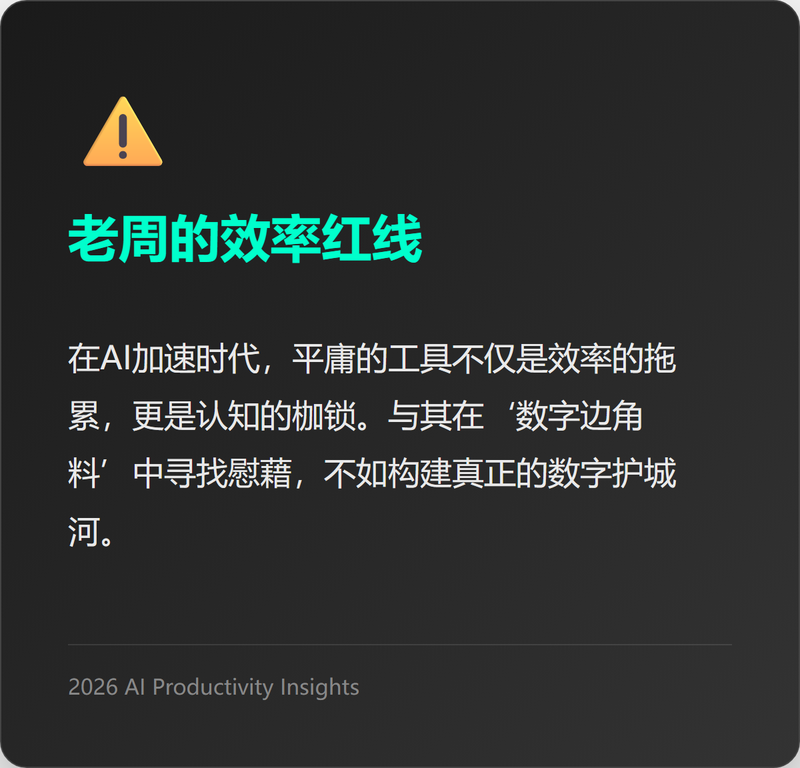
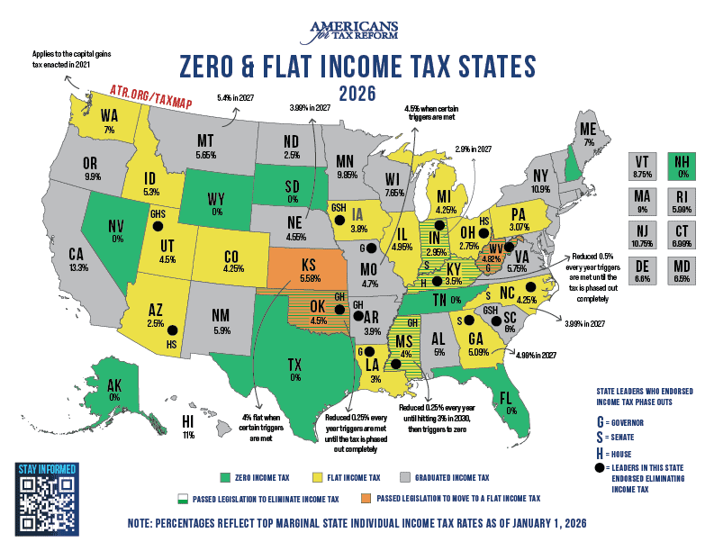
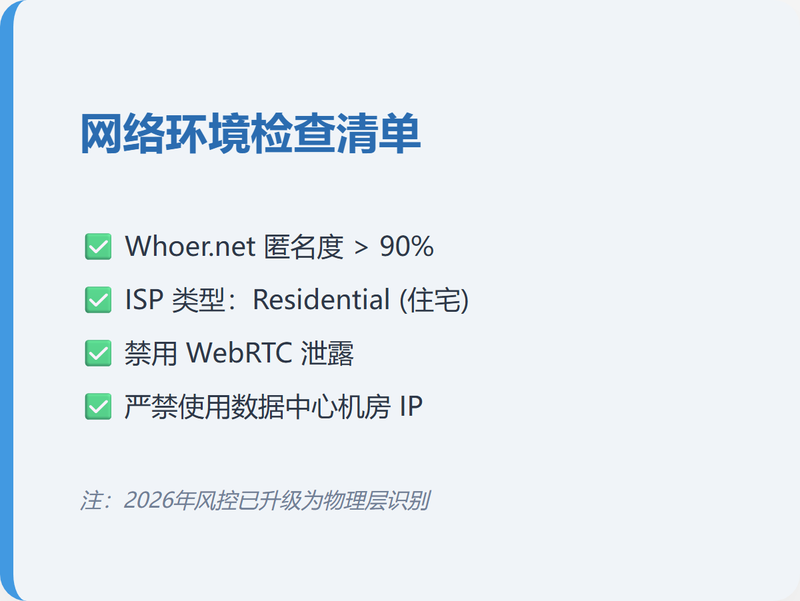
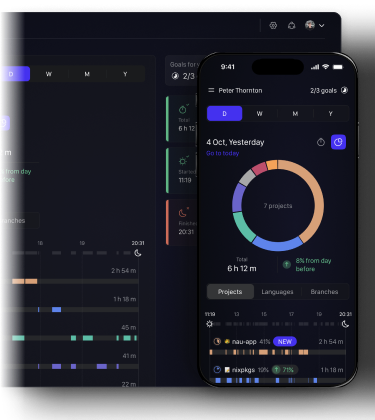

# 国内怎么下ChatGPT？2026年的正确姿势只有这两种

2026版：中国区ChatGPT-5.2极速部署路径
别再浪费时间：美区Apple ID与原生IP避坑指南
比起原生App，资深PM为什么更偏爱NunuAI？

还在满世界找镜像站？快醒醒，那都是玩剩下的‘数字边角料’。在当前GPT-5.2都快自动化的年代，你却连正版入口都摸不到。这不是技术问题，是底层认知的贫穷。如果你不想在这个AI加速的环境中掉队，花5分钟，我带你走那条最稳、也是最难踩坑的路。

到了2026年，如果你还在所谓镜像站里刷着那点存在感，我建议你先反思一下自己的职业天花板。

很多人跑来问我：“老周，现在的ChatGPT-5.2怎么下载最稳？”我说你问错问题了。在OpenAI账号审计进化到AA级、物理屏蔽不可逆的今天，手机桌面上的那个App图标只是冰山一角。用着被阉割逻辑的免费版，就像是在这种信息爆炸的时代开着一辆限速40码的坦克。你觉得你拥有了火力，其实你连战场的边都没摸着。

### 1. 彻底铲除山寨快感的思维毒瘤

在这个Claude-4.5和GPT-5.2神仙打架的阶段，大模型的能力分层已经到了极其残暴的地步。

很多国内所谓的中文版或者集成站，为了省那点Tokens成本，背地里做了大量的逻辑裁剪。你问它一个复杂的架构问题，原生5.2会调用深度推理模型在大脑里跑三圈，而山寨版可能直接给你套用了一个过时的V3.2模板。最恶心的是延迟，那种几秒钟才蹦出一个字的断层感，正在悄悄摧毁你的深度思维流。

**记住老周一句话：免费的东西，最贵的从来不是钱，是你的时间价值。**

 你在阉割版AI身上浪费的每一个小时，都是在拉大你与全球顶尖生产力的代差。

### 2. 实操手册：构建你的“数字离岸中心”

想用原生App？别上来就搜下载，那是菜鸟干的事。先解决身份问题。

#### 步骤一：美区Apple ID的物理隔离
现在注册美区ID，风控策略已经更新到“非VoIP号强制验证”。别去买那种5块钱一个的批发号，那是在大数据的眼皮子底下裸奔。
*   **注册点**：直接去苹果官网，国家选 United States。
*   **电话验证**：找个靠谱的美国实体SIM卡（比如PayGo或Ultra Mobile），月租3刀那种。别用虚拟号，2026年的风控系统秒杀一切虚拟号段。
*   **地址避坑**：选俄勒冈（Oregon）或特拉华（Delaware）等免税州，否则你充值100刀，订阅时发现还要额外扣你几刀的消费税，坑死你。

#### 步骤二：网络环境的处女洁癖
别再用那些几块钱一月的机场了，那种机房IP在OpenAI的后端系统里全红。
*   **工具**：打开 `whoer.net`。
*   **硬指标**：**匿名度必须大于90%**。
*   **核心逻辑**：必须找支持“住宅代理（Residential IP）”的节点。如果检测结果显示你的ISP是谷歌云或亚马逊云，直接放弃，账号被封只是早晚的事。

#### 步骤三：支付链路的绝缘
黑卡是重灾区。那些宣称46块钱买Plus的，大概率是低价区退款流，你的账号大概率在三个月内被永久封禁。**唯一正路**：在苹果官网用国内双币信用购买 Gift Card 充值，或者通过正规持牌的虚拟卡平台。

### 3. 降维打击：为什么 NunuAI 是中国职场的最优解

说实话，作为一名PM，我并不经常折腾原生App，太累。如果你追求的是干活，而不是为了那个图标装逼，我更推荐你用 [NunuAI](https://nunu.chat)。

这不是硬广，这是职业效率的逻辑。原生App像是个傲慢的外宾，它不懂中国职场的协作逻辑。而 [NunuAI](https://nunu.chat) 做的是全家桶级的逻辑聚合。

*   **跨模型对标**：在原生App里，你想对比 GPT-5.2、Claude-4.5 和 Gemini-3.0 的结果，你得开三个网页，手动贴三遍提示词。但在 [NunuAI](https://nunu.chat) 界面下，一键调用。这种横向比对的能力，在处理长代码逻辑或者财报分析时简直是救命稻草。
*   **国内直连的优雅**：你不需要去忍受那些随时断连的代理，更不需要担心因为IP跳变导致账号被风控封锁。它解决了合规与效率的悖论。

*   **生产力工作流**：它把 GPT-5.2 的推理能力、Google-NanoBanana 的画图能力揉碎了喂到你嘴里。比如你写个需求文档，它会先让 DeepSeek 回答一遍逻辑点，再让 GPT-5.2 查漏补缺。这种“多模型众议机制”是原生 App 目前完全无法实现的。

**老周的私人建议：** 
如果你是极客，喜欢折腾，按我第二部分的SOP去搞一套离岸环境；如果你是跟我一样，每天要处理几十个案子、时间按分钟算的职业人，直接上 [NunuAI](https://nunu.chat)。

别在工具的选择上耗费过多的生命，真正的价值在于你用这些顶级AI生产出了什么。不要做工具的奴隶，要做效率的主人。

写完这段我也要去跑我的产品路线图了，祝你在2026年还没被AI淘汰。