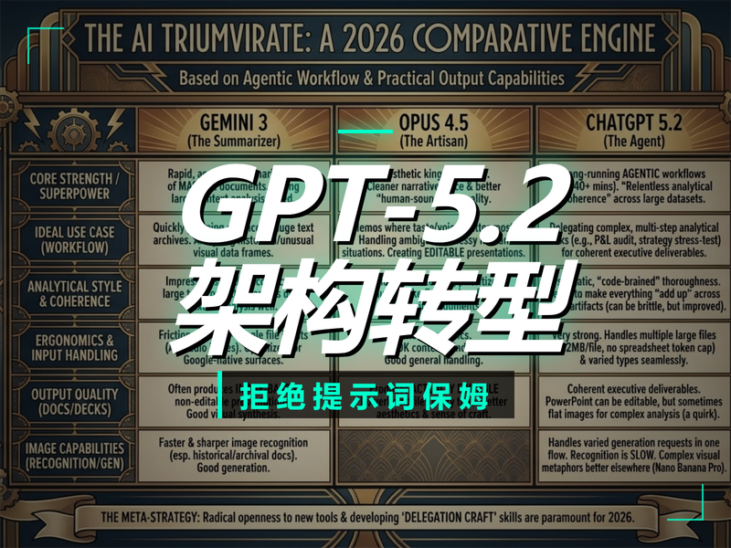
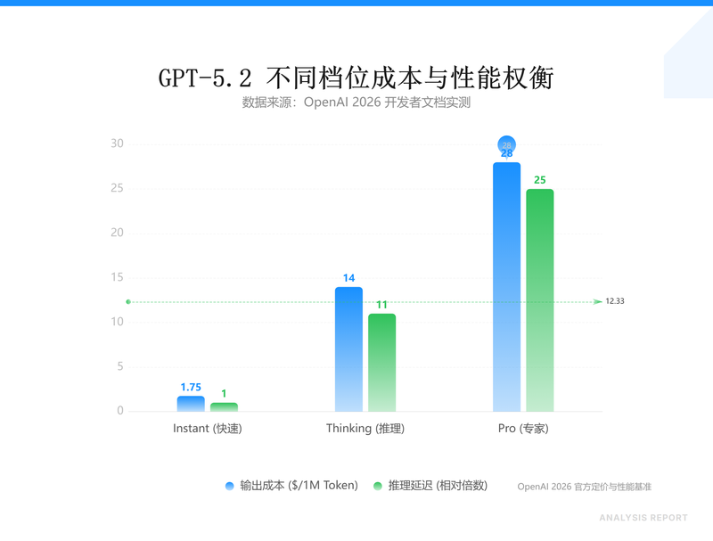
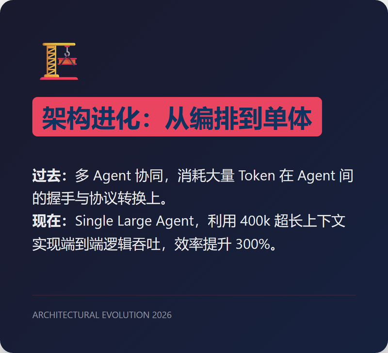
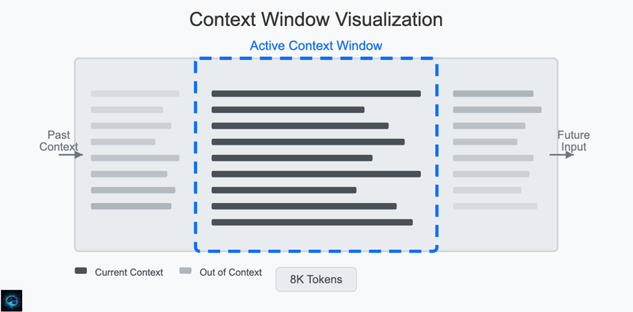
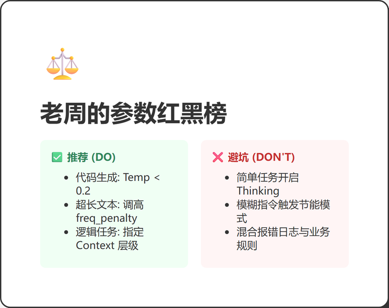
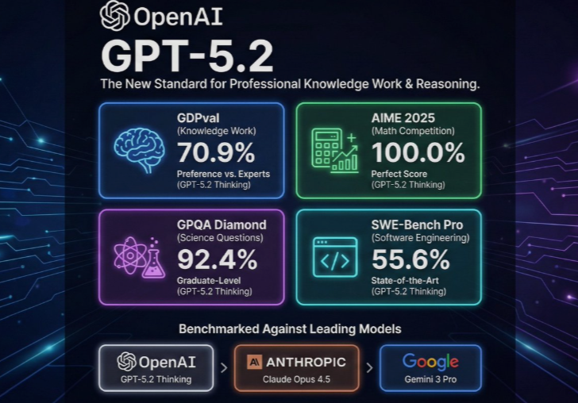

# GPT-5.2 降临：别再给 AI 当'提示词保姆'了，聊点架构转型的硬逻辑




2026年了，如果你还在为'GPT又要涨价'或者'AI要抢饭碗'这种话题焦虑，那老周得泼盆冷水：GPT-5.2 真正杀死的不是你的岗位，而是你那套过时的、基于固定算力的搬砖思维。


1. 别被 'Thinking' 模式的专家光环给唬住了

很多老板一看发布会 PPT 上的"博士级推理能力"就高潮，恨不得把公司所有客服业务都接上 GPT-5.2 的 Thinking 模式。如果你也这么干了，月底你的财务主管会拎着刀来找你。

**核心真相：Thinking 模式不是解药，而是一场昂贵的赌术。**

GPT-5.2 把模型分成了 Instant、Thinking 和 Pro 三个档位。Thinking 确实猛，在 SWE-Bench 能跑出 80% 的准确率，但你要看成本：输入 $1.75/1M，输出直接飙到 $14.00。对比 Instant，响应延迟增加了 11 倍，Token 单价翻了 8 倍。




大多数业务场景，比如自动化调 Bug、写简单的 SQL、回复用户邮件，用 Instant 配合精准的 Context 就够了。Thinking 这种模式只适合处理那种"人类看了也得挠头两分钟"的逻辑链。现在的现状是：如果你不会动态调参，模型就在那瞎思考，给你吐出一堆带有哲学味的废话，结果还是错的。

**老周的建议：** 别在大炮轰蚊子时炫耀火力。如果你想省钱又提效，可以去 [NunuAI](https://nunu.chat) 跑一下对比测试。它整合了 GPT-5.2 和 Claude-4.5 等顶尖模型，你可以用同一套 Prompt 在这几个模型里切。你会发现，很多时候 Instant 档位配合 NunuAI 的多模型聚合调度，ROI 远高于死磕 Thinking 模式。

2. 单体代理 (Single Large Agent) 架构的残酷真相

如果你还在迷恋两年前流行的 Agent 编排框架（比如那套繁琐的消息总线、复杂的工具调用路由），我可以负责任地告诉你：那玩意儿已经过时了。

GPT-5.2 的核心进化在于它从"多代理协同"转型成了"单体大型代理 (Single Large Agent)"。官方直接在架构层整合了 20 多个核心工具。这意味着，你不再需要在那折腾微服务一样的 Agent 矩阵，去操心 Agent A 怎么把结果传给 Agent B。

**开发者要做的转变：回归长上下文的结构化约束。**

现在的 GPT-5.2 有 400k 的上下文窗口（输出能撑到 128k）。以前你需要拆成 10 个 Prompt 碎片去生成的微服务模块，现在可以一次性塞进去。

**实操代码片段（直接拿走）：**
别再一段一段喂了，试试这种整体吞吐风格：
```json
// GPT-5.2 结构化投喂示例
{
  "context_scope": "Full Service Architecture",
  "dependencies": ["OAuth2", "Redis_Cache", "PostgreSQL"],
  "output_constraint": "Single-file modular python",
  task: "生成带缓存层和单元测试的身份验证模块，输出不少于1000行代码，必须符合PEP8规范"
}
```
这种暴力美学直接让以前那些所谓的编排框架（如早期的 LangChain）显得像是在修牛车。



你现在要练的，是这种长文本下的压测感，看它在 100k 文本之后是否还能保持逻辑不飘移。




3. 实操 SOP：如何像我一样驯服 GPT-5.2

把 AI 当成一个"有情绪但记性好的高级专家"，而不是"听话但没脑子的实习生"。GPT-5.2 有个动态激活机制（基于 128 维特征向量），如果你给的指令太模糊，它会自动进入类似降智的节能模式。

**老周的私房 Checklist：**

*   **温度值 (Temperature) 别胡填：** 做代码生成建议死磕 **0.2** 以下；写创意文案给到 **0.85**；但在处理 100k 以上超长上下文时，建议设为 **1.0** 并调高 **frequency_penalty**，否则它会在输出后期开始机械重复。
*   **上下文分层注入法：** 别把报错日志和需求混在一起。第一层喂业务规则，第二层喂环境依赖（SSH 端口别用默认、Key 登录强制开启等像素级细节），第三层才喂具体的报错。
*   **逆向诱导技巧：** 针对 GPT-5.2 的 Thinking 强制冷却。如果你发现它在简单任务上强行启动逻辑推演导致超时，在 Prompt 末尾加一句：`Return direct output without chain-of-thought analysis for efficiency.`。




**最后说点扎心的：** 行业泡沫正在破裂，GPT-5.2 这种怪兽的出现，是为了让那些只会写 Prompt 的调优师下岗，让真正懂业务逻辑的人上场。如果你觉得模型难用，大概率是因为你的业务逻辑压根没理顺。

别废话，去 [NunuAI](https://nunu.chat) 挂个 GPT-5.2，用我给的参数跑一遍，你会发现新大陆。



